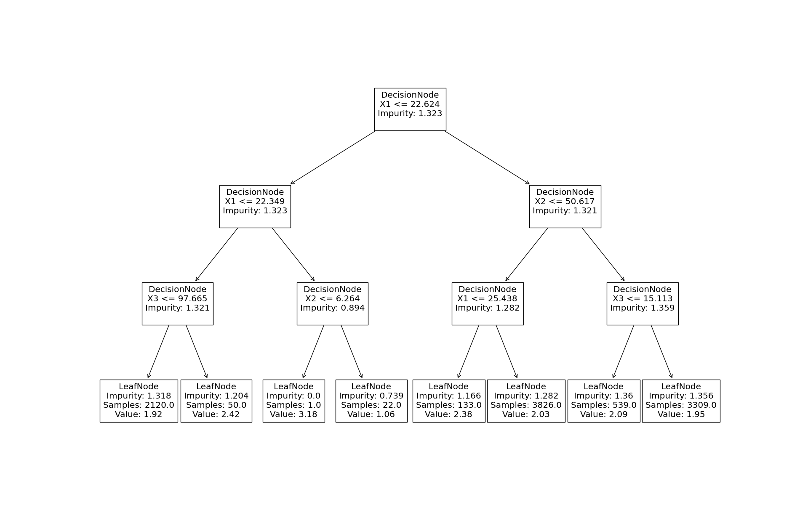

# Visualizations and analysis tools

## Visualising DecisionTrees

adaXT provides general plotting functionality with matplotlib. An example of
plotting a random DecisionTree with a maximum depth of 3 can be seen below:

```python
from adaXT.decision_tree import DecisionTree, plot_tree
import numpy as np
import matplotlib.pyplot as plt

N = 10000
M = 5
X = np.random.uniform(0, 100, (N, M))
Y = np.random.uniform(0, 4, N)
tree = DecisionTree("Regression", max_depth=3)
tree.fit(X, Y)

# Get screen width and height
dpi = plt.rcParams["figure.dpi"]


plt.figure(figsize=(19, 12))
plot_tree(tree)
plt.show()
```

Which could produce a tree, such as this one:



## Analysing the DecisionTree

adaXT DecisionTrees are built up of individual [Nodes](../api_docs/Nodes.md).
Under the hood, adaXT calls these nodes when predicting. This makes it possible
for the user to traverse the tree in their own manner, such that each individual
node can be looked at in more detail. As an example, below is a script provided,
which simply prints all the nodes in the tree.

```python
from adaXT.decision_tree import DecisionNode, LeafNode
import numpy as np

def recurse_node_left(cur_node):
    if isinstance(cur_node, DecisionNode):
        print("DecisionNode")
        print(f"X{cur_node.split_idx} <= {cur_node.threshold}")
        recurse_node_left(cur_node.left_child)
        recurse_node_left(cur_node.right_child)
    else:
      # If not a DecisionNode, then it will always be LeafNode
      assert(isinstance(cur_node, LeafNode)) 
      print("LeafNode")
      print(f"Value: {cur_node.value}")


recurse_node_left(tree.root)
```

This recursive function run on the tree provided in the previous section, would
give the output:

```verbatim
DecisionNode
X1 <= 22.623711878856856
DecisionNode
X1 <= 22.349316943202385
DecisionNode
X3 <= 97.66450448532115
LeafNode
Value: [1.92268088]
LeafNode
Value: [2.42121542]
DecisionNode
X2 <= 6.263581890564451
LeafNode
Value: [3.17642358]
LeafNode
Value: [1.0559612]
DecisionNode
X2 <= 50.61685788523325
DecisionNode
X1 <= 25.438273441628738
LeafNode
Value: [2.3826478]
LeafNode
Value: [2.03267368]
DecisionNode
X3 <= 15.113109194828294
LeafNode
Value: [2.09236662]
LeafNode
Value: [1.95213703]
```
